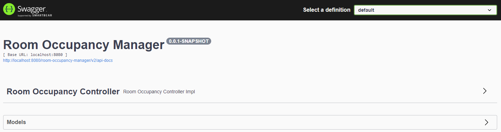

# Room Occupancy Manager

## Building from sources
The build requires at lest `Java 11 JDK`

## Installing
- Clone the repository
- Run `mvn clean install` to compile and package the codebase
- Run the `Spring Boot Application`
- Swagger is available under: `http://localhost:8080/room-occupancy-manager/swagger-ui/#/`

## Testing
- Run `mvn clean install` to run the tests
